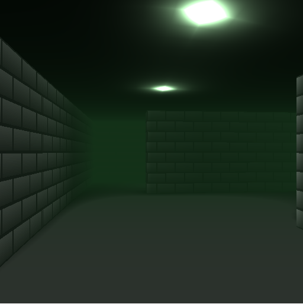

# RayKarstenWASM

Tutorial Web Assembly and Ray Casting

## Quickstart

Following is a quickstart guide to get your computer setup for running the demo

### Get Emscript

#### Get the emsdk repo
```
git clone https://github.com/emscripten-core/emsdk.git
```

#### Enter that directory
```
cd emsdk
```

#### Download and install the latest SDK tools.
```
./emsdk install latest
```

#### Make the "latest" SDK "active" for the current user. (writes ~/.emscripten file)
```
./emsdk activate latest
```

#### Activate PATH and other environment variables in the current terminal
```
source ./emsdk_env.sh

cd ..
```

### Running the demo

```
git clone https://bitbucket.alexandra.dk/scm/cg/raykarstenwebasm.git

cd raykarstenwebasm

chmod +x runMake.sh
chmod +x setEnv.sh

./setEnv.sh
./runMake.sh
```
